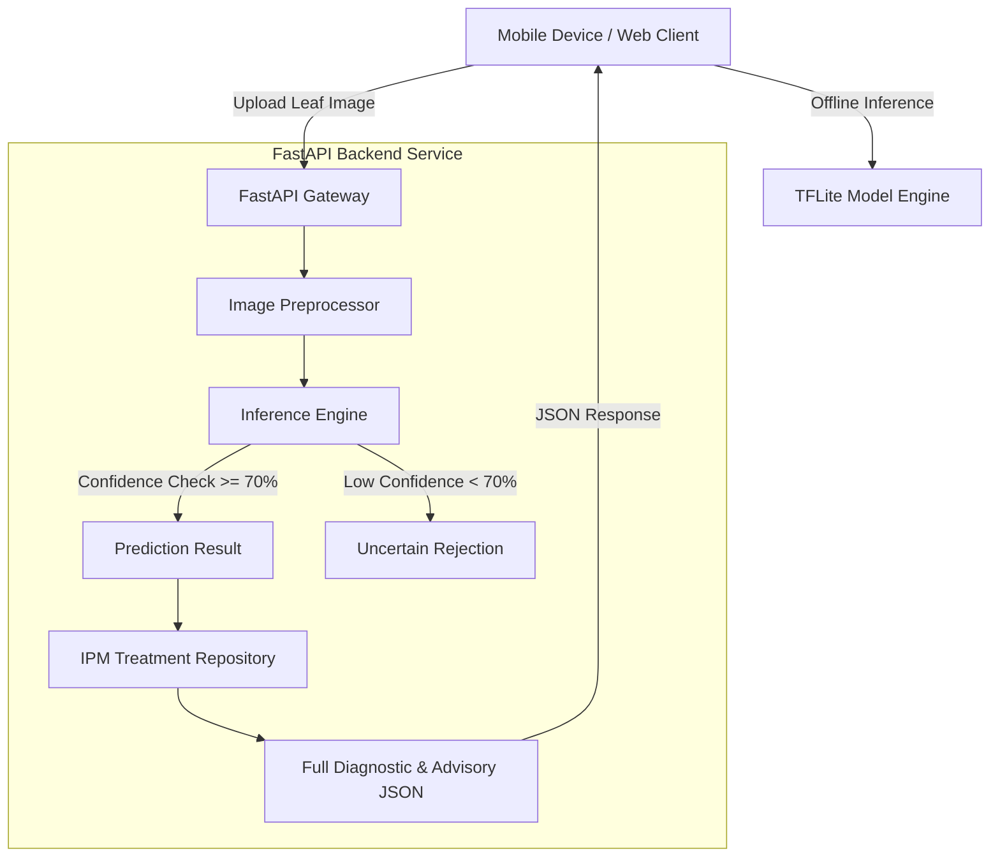

# PlantScan AI: Multi-Crop Disease Diagnosis & IPM Advisory System

## 🌿 Executive Summary

**PlantScan AI** is an end-to-end, edge-cloud deep learning solution designed for real-time agricultural crop disease diagnosis and Integrated Pest Management (IPM) advisory delivery. Developed to assist farmers, agronomists, and agricultural extension workers, PlantScan AI accurate classifies leaf pathologies across **10 key agricultural crops** (**46 canonical disease/health classes**) and provides actionable organic, biological, and chemical treatment guidelines with strict safety warnings and pre-harvest intervals (PHI).

The platform features a dual-engine architectural framework supporting both **cloud RESTful microservices** (FastAPI) and **offline mobile edge inference** (TensorFlow Lite).

---

## 🎯 Core Features & Capabilities

1. **Multi-Crop Disease Diagnosis**:
   - Classifies diseases across 10 major crops: **Apple, Banana, Bell Pepper, Cotton, Grape, Maize (Corn), Mango, Potato, Rice, and Tomato**.
   - Supports 46 fine-grained canonical disease categories and healthy leaf states.

2. **Integrated Pest Management (IPM) Knowledge Base**:
   - Delivers structured treatment advisories tailored to each specific diagnosis.
   - Prioritizes **Cultural & Biological Control**, **Organic Remedies**, followed by **Chemical Interventions**.
   - Includes mandatory **Personal Protective Equipment (PPE)** safety rules and **Pre-Harvest Intervals (PHI)**.

3. **Out-of-Scope & Uncertainty Rejection**:
   - Employs confidence thresholding ($<70\%$ confidence) to return an `Uncertain` diagnosis rather than inaccurate predictions.
   - Rejects non-plant/corrupt image uploads to maintain diagnostic reliability.

4. **Dual Inference Engine Support**:
   - **Cloud Inference Engine**: Keras (`.keras`) / MobileNetV2 for high-precision server-side batch inference.
   - **Edge Inference Engine**: Quantized TensorFlow Lite (`.tflite`) for low-latency offline mobile scanning.

5. **RESTful FastAPI Microservice**:
   - High-throughput asynchronous backend service with OpenAPI/Swagger interactive UI (`/docs`).
   - Standardized JSON responses for mobile and web integration.

---

## 📊 Dataset & Class Distribution (10 Crops, 46 Classes)

The underlying dataset comprises **34,314 cleaned, audited images** across 10 crop species, processed using SHA-256 deduplication and quality filters:

| Crop Species | Supported Canonical Classes | Total Images |
| :--- | :--- | :---: |
| **Apple** | Apple Scab, Black Rot, Cedar Apple Rust, Healthy | 3,171 |
| **Banana** | Cordana, Black Sigatoka, Healthy, Pest Feeding, Yellow Sigatoka | 2,840 |
| **Bell Pepper** | Bacterial Spot, Healthy | 2,475 |
| **Cotton** | Armyworm, Bacterial Blight, Healthy, Powdery Mildew, Target Spot | 2,180 |
| **Grape** | Black Rot, Esca (Black Measles), Leaf Blight (Isariopsis), Healthy | 4,062 |
| **Maize (Corn)** | Cercospora Leaf Spot (Gray Leaf Spot), Common Rust, Northern Leaf Blight, Healthy | 3,852 |
| **Mango** | Anthracnose, Bacterial Canker, Cutting Weevil, Die Back, Gall Midge, Healthy, Powdery Mildew, Sooty Mould | 2,910 |
| **Potato** | Early Blight, Late Blight, Healthy | 2,152 |
| **Rice** | Bacterial Leaf Blight, Brown Spot, Healthy, Hispa, Leaf Blast | 3,358 |
| **Tomato** | Bacterial Spot, Early Blight, Late Blight, Leaf Mold, Septoria Leaf Spot, Spider Mites (Two-Spotted), Target Spot, Yellow Leaf Curl Virus, Mosaic Virus, Healthy | 7,314 |

---

## 🏗️ System Architecture



### Component Details:

1. **Preprocessing Pipeline (`preprocessing/`)**:
   - Cleans raw multi-dataset image inputs (*PlantVillage, PlantDoc, Rice, Banana, Cotton, Mango*).
   - Generates SHA-256 hash digests to identify and remove near-duplicate images.
   - Enforces an 80% Train / 10% Validation / 10% Test reproducible dataset split.

2. **Machine Learning Pipeline (`experiments/` & `ml/`)**:
   - Built on **MobileNetV2** architecture using ImageNet pretrained weights.
   - Fine-tuned using categorical cross-entropy loss, Adam optimizer, learning rate decay, and class weighting to address imbalance.
   - Exported to `.keras` format and quantized into `.tflite` format for edge deployment.

3. **IPM Treatment Database (`treatment_database/`)**:
   - Structured JSON database housing expert-validated agronomic advisories.
   - Features crop-specific diagnostic details, symptoms, prevention, organic control, chemical remedies, and university extension references.

4. **Production REST API (`backend/`)**:
   - Built with **FastAPI** and **Uvicorn**.
   - Modular architecture separating routers, request/response schemas, image processing services, and treatment lookups.

---

## 📁 Repository Structure

```
PlantScanAI/
├── backend/                        # FastAPI Production Backend Service
│   ├── api/                        # API Routes (health, predict, treatments)
│   ├── schemas/                    # Pydantic Request & Response Schemas
│   ├── services/                   # Business Logic & Inference Engine
│   ├── tests/                      # Pytest Automated Test Suite (16 Test Cases)
│   ├── config.py                   # Global Backend Configuration
│   └── main.py                     # FastAPI Application Entrypoint
├── data_collection/                # Dataset Audit, Crawling & Taxonomy Scripts
├── datasets/                       # Dataset Storage & Reports
│   └── reports/                    # SHA-256 Audit & Split Reports
├── docs/                           # Architecture & Dataset Documentation
├── experiments/                    # Model Training Experiments (MobileNetV2)
├── ml/                             # Machine Learning Models & Predictors
│   ├── inference/                  # Crop Disease Predictor CLI Interfaces
│   └── weights/                    # Model Weights (.keras & .tflite)
├── mobile_app/                     # React Native Mobile Client Codebase
├── preprocessing/                  # Dataset Cleaning & Validation Scripts
├── treatment_database/             # IPM Organic & Chemical Advisory JSON Files
├── .venv/                          # Project Python Virtual Environment
├── requirements.txt                # Production Dependencies
├── requirements-full.txt           # Extended Training & ML Dependencies
└── README.md                       # Quick Overview
```

---

## 🔌 API Endpoint Overview

| Method | Endpoint | Description |
| :---: | :--- | :--- |
| `GET` | `/` | API Root status check and operational metadata |
| `GET` | `/api/v1/health` | Service health status and engine readiness |
| `POST` | `/api/v1/predict` | Predict crop disease from multipart image upload or Base64 string |
| `GET` | `/api/v1/treatments/crops` | List all 10 supported crops in the database |
| `GET` | `/api/v1/treatments/classes` | List all 46 canonical disease classes |
| `GET` | `/api/v1/treatments/advisory` | Fetch IPM treatment advisory for a given crop and disease |

---

## 🔬 Tech Stack Summary

- **Programming Language**: Python 3.12+
- **Deep Learning Framework**: TensorFlow 2.x / Keras, TensorFlow Lite
- **Model Architecture**: MobileNetV2 (Transfer Learning & Fine-tuning)
- **Backend Framework**: FastAPI, Pydantic, Uvicorn, Pytest
- **Image Processing**: Pillow (PIL), NumPy
- **Mobile Frontend**: React Native (TFLite Edge Integration)
- **Version Control & Quality**: SHA-256 Deduplication, Automated Pytest Suite
